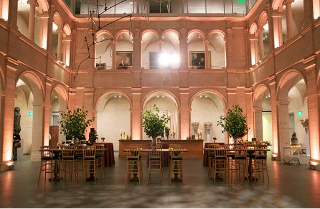
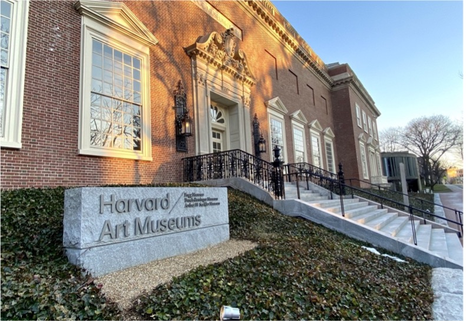

## Gala

**Date**: Saturday, February 1 

**Time**: 20:00 – 23:30 

**Location**: Harvard Art Museum, 32 Quincy Street, Cambridge, Massachusetts

  

  

The Conference will culminate in an elegant Closing Gala hosted at the prestigious Harvard Art Museum. This event is open to all conference attendees, including speakers, dignitaries, and guests, offering a memorable conclusion to the weekend's discussions and connections.

The Closing Gala offers an opportunity to celebrate the success of the conference in a refined atmosphere surrounded by the timeless art and architecture of the Harvard Art Museum. Guests will enjoy an evening of exquisite hors d'oeuvres, stimulating conversation, and cultural enrichment as they reflect on the ideas shared and connections forged during the event.

Located at 32 Quincy Street in the heart of the Harvard campus, the Harvard Art Museums house one of the finest collections of art in the world, providing a perfect backdrop for this distinguished gathering. The gala promises to embody the spirit of innovation, excellence, and community that defines the conference. The galleries will be open for the first hour of the gala, between 20:00-21:00, offering attendees a chance to explore masterpieces by renowned artists such as Vincent van Gogh, Paul Cézanne, and Hiroshi Yoshida.

Purchase a [gala ticket](https://secure.touchnet.net/C20832_ustores/web/store_main.jsp?STOREID=18&SINGLESTORE=true) to make sure you do not miss out on this memorable event!
