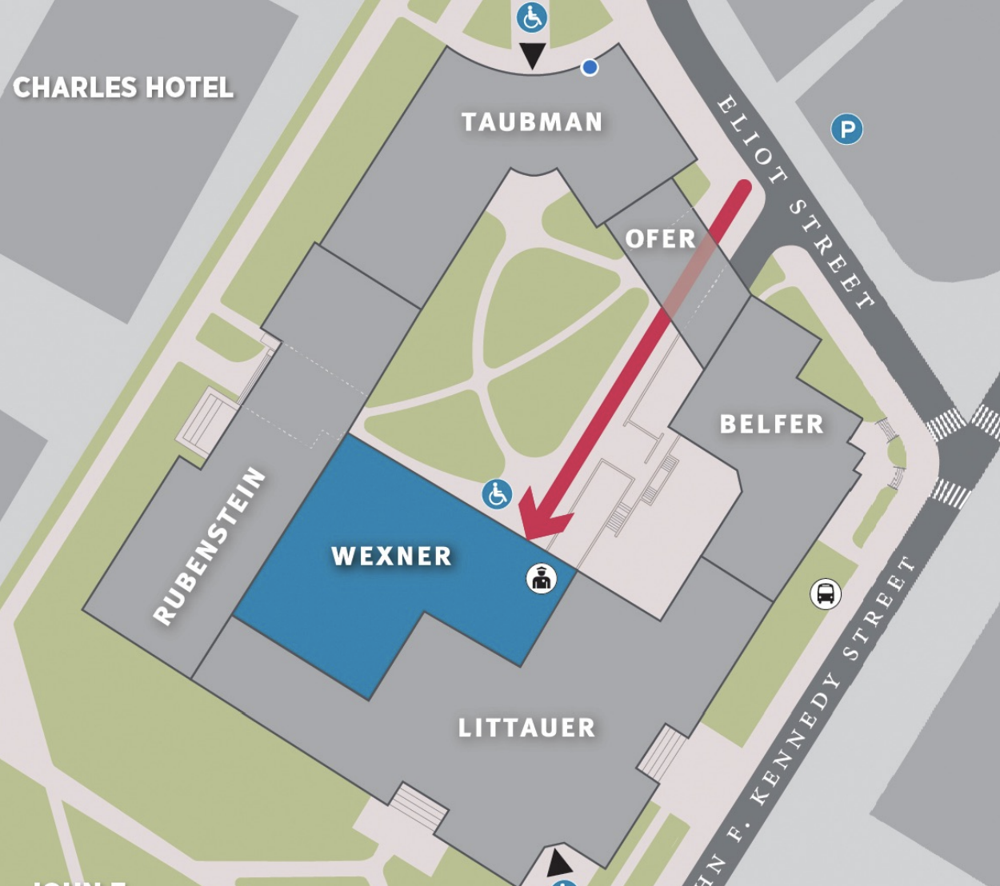

## Information for attendees

### Important notes
1. The name on your ticket *must* match photo ID that you will present at the registration desk to receive your name tag. We ask that you wear your name tag at all conference events.
2. The 4:00PM event with [Roberta Metsola](https://euroconf.eu/speakers/metsola/) and [Sviatlana Tsikhanouskaya](https://euroconf.eu/speakers/tsikhanouskaya/). Please [register here](https://hksexeced.tfaforms.net/f/iop-forum-register?c=7014V000002IzgHQAS&_ga=2.97960799.1960630084.1679456944-1530269755.1674477134&_gl=1*1vq5sl*_ga*MTUzMDI2OTc1NS4xNjc0NDc3MTM0*_ga_72NC9RC7VN*MTY3OTYxOTQ0OC40MC4xLjE2Nzk2MTk0OTIuMTYuMC4w) and selected "European Conference" as your affiliation. 

### Locations

The European Conference is taking place at two locations:
* At the Harvard Law School (HLS), on Friday between 11:30am and 3pm. ([Google Maps link](https://goo.gl/maps/htrvHFs7z96YqeYs9))
* At the Harvard Kennedy School (HKS), on Friday from 3pm onwards and on Saturday ([Google Maps link](https://www.google.fr/maps/place/42%C2%B022'18.5%22N+71%C2%B007'17.8%22W/@42.371812,-71.121622,17z/data=!3m1!4b1!4m4!3m3!8m2!3d42.371812!4d-71.121622)). 

The reception will take place at the Harvard Natural History Museum (see below).

### The reception

The reception will take place at the Harvard Museum at Natural History ([Google Maps link](https://goo.gl/maps/nZBwzoneR4jcRgeY7)). Please arrive at 6:45pm.

The Prime Minister of Montenegro, [Dritan Abazović](https://euroconf.eu/speakers/abazovic/), will give a keynote address.

The [Harvard Glee Club](https://harvardgleeclub.org/) will perform live at the event. Drinks and food will be provided. The dress code for the reception is business casual.
