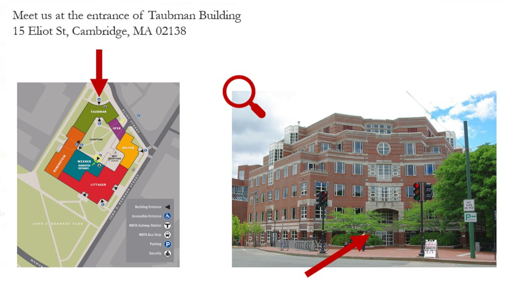

## Information for attendees

### Conference

The European Conference will take place at the Harvard Kennedy School on Friday, February 9, and Saturday, February 10. The address is 79 John F. Kennedy Street, Cambridge, MA 02138 ([Google Maps link](https://www.google.fr/maps/place/42%C2%B022'18.5%22N+71%C2%B007'17.8%22W/@42.371812,-71.121622,17z/data=!3m1!4b1!4m4!3m3!8m2!3d42.371812!4d-71.121622)). Please see the [schedule](https://euroconf.eu/schedule/) for a full list of times for the event.

#### Entrance
On Friday, please enter through the **Taubman entrance** of the building, as shown in the image below. Attendees will register at a table in the lobby. 

On Saturday, please enter through the **main entrance**, as shown in the image below. Attendees will check in again or register for the first time at a table in the lobby. 

#### Registration and Food
Attendees do not need to bring a physical or digital ticket with them, but they should bring a **photo ID** both days so their name can be verified against our list of those who have purchased a ticket. The registration table will be open all day both days to accomodate those who arrive later. Conference badges will be provided to all attendees.

**Lunch** will be provided both days. Coffee and snacks will be provided during breaks.

#### Marshall Plan Exhibition
The Marshall Plan, started in 1948, was designed with several goals in mind: to relieve food shortages in Europe, to rebuild the European industry, to curb communism on the continent, and to bring unity to the continent. In 1950 a contest was announced to find a fitting image to strengthen (Western) European collaboration and shared identiy. Out of 10,000 designs, a jury selected the 25 posters you can see exhibited in the Winter Garden. These posters feature themes relating to diversity and unision, and to the challenges European countries faced together. Do they inspire as they did back then? See for yourself!

#### Workshops
Multiple workshops will be offered at the conference. Workshops are events in which attendees will be able to interact with a speaker in a smaller setting of 20-25 people. Given the limited space available, conference attendees must sign up for these workshops in advance. An email sent will be sent to all registrants on **February 7, 2024**, with a link to sign up for workshops.

### Farewell Gala

The farewell gala and reception will take place at the Harvard Faculty Club beginning at 8:00pm on Saturday, February 10. The address is 20 Quincy St, Cambridge, MA 02138 ([Google Maps link](https://www.google.com/maps/place/Harvard+Faculty+Club/@42.3732533,-71.1167595,17z/data=!3m1!4b1!4m6!3m5!1s0x89e377a7db192837:0xa7254ff63e9ae82e!8m2!3d42.3732494!4d-71.1141792!16s%2Fg%2F11bws8cjzj?entry=ttu)). All attendees must have purchased both a conference and a reception ticket. All attendees must be at least 21 years old, as drinks will be offered. As with the conference, attendees do not need to bring a physical or digital ticket with them, but they should bring a **photo ID with their date of birth** so their name and age can be verified. The dress code for the reception is **business to business formal / festive**--feel free to come directly from the conference or change in your festive attire! 
